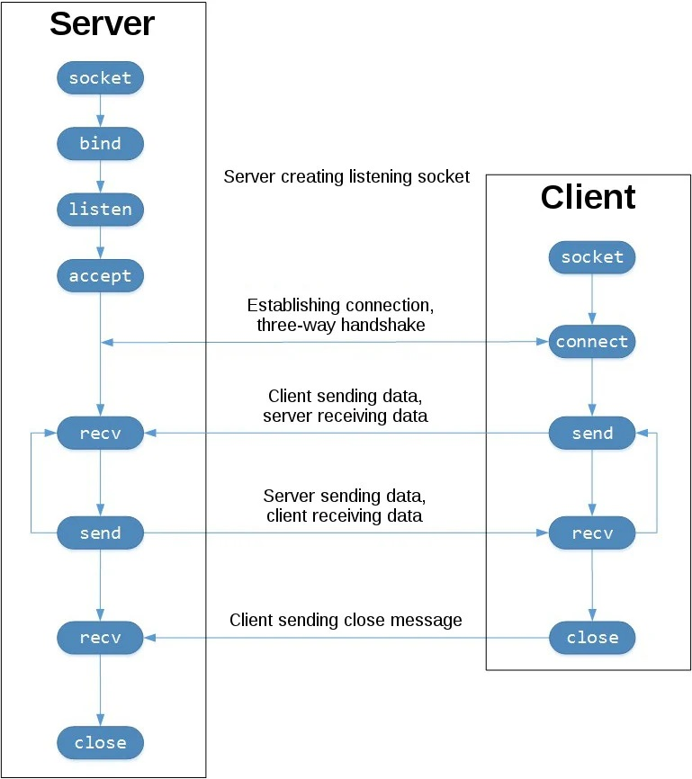

# socket_programming_in_python

Today I learn some basic socket programming in python and build a simple client/server application that communicates by network socket.

## What is a socket?
A network socket is an endpoint of a two-way communication link between two parties - client and server in my case - which are running on the network. This can be on the same computer as well as on different systems which are connected via the network.

## The sequence of socket API calls and data flow for TCP:

 

# The resource：

[Socket Programming in Python (Guide)](https://realpython.com/python-sockets/)  
[Socket Programming in Python](https://www.geeksforgeeks.org/socket-programming-python/)  
[Python Socket Programming – Server, Client Example](https://www.journaldev.com/15906/python-socket-programming-server-client)  
[Beej's Guide to Network Programming](https://beej.us/guide/bgnet/html/#socket)
[Addressing, Protocol Families and Socket Types](https://pymotw.com/2/socket/addressing.html)

Two vedio tutorials: 
[1](https://www.youtube.com/watch?v=3QiPPX-KeSc) , 
[2](https://www.youtube.com/watch?v=8A4dqoGL62E)
